# JavaEE-Exercise

# Team

| Name | Student ID |
|------|------------|
| 张泽清  | 20301030   |
| 贺依婷  | 20301039   |
| 叶颖芝  | 20301029   |

# **Assignment 1, A Shipping and Transportation Web application Development with Spring MVC and More**

# 运行截图

<div style="text-align: center;">

<div style="text-align: center;">

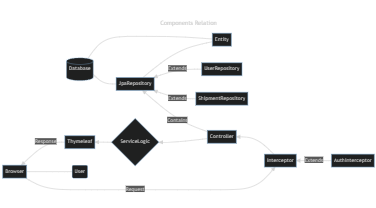

</div>

<div style="text-align: center;">


</div>
<div style="text-align: center;">


</div>
<div style="text-align: center;">


</div>

</div>

# 1. 系统概述

> 简要介绍你要设计的系统，包括系统的目的、目标用户、使用场景、系统需求等等。

+ 用户账户管理系统：用户注册、登录、密码重置、个人信息维护等功能。
+ 运输服务管理系统：包括运输方式、物流方案、配送区域等信息的管理。

# 2. 系统架构

> 描述系统的整体架构，包括系统的分层、组成部分、组件之间的关系、系统流程等等。使用图表、图示等方式展示系统的架构，方便读者理解。

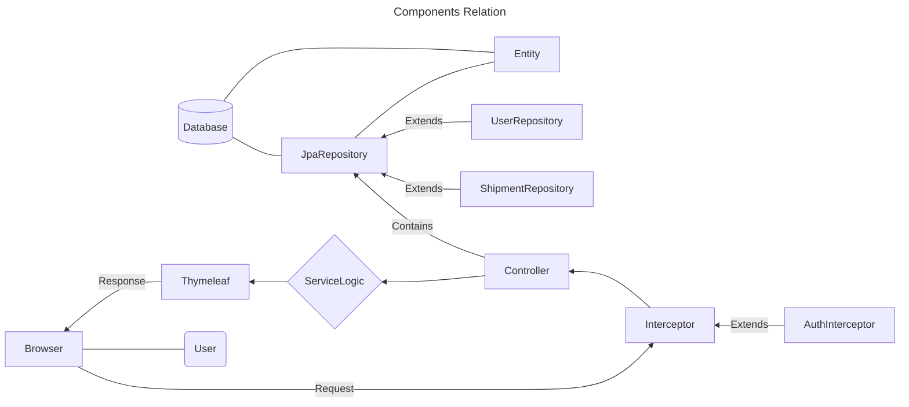

<div style="text-align: center;">


</div>

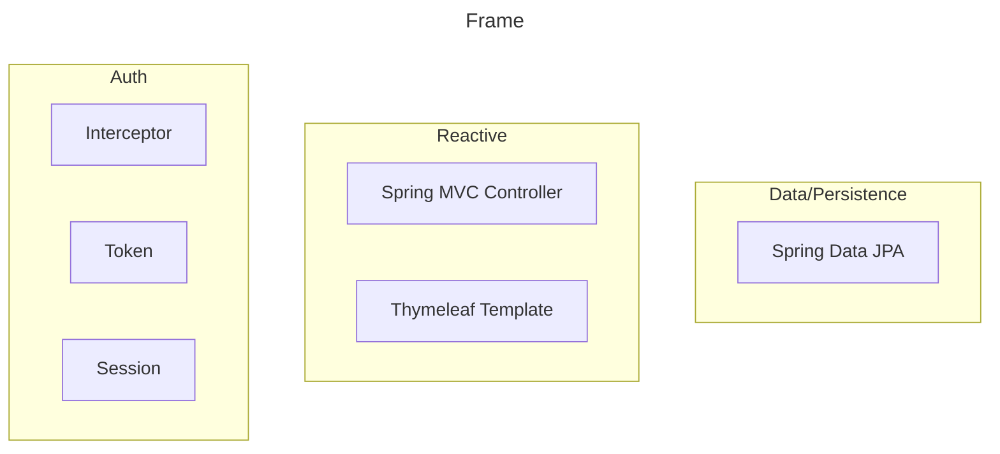

<div style="text-align: center;">

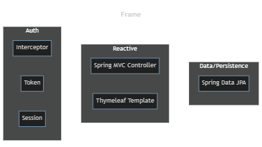

</div>
# 3. 技术选型

> 列出你在系统设计中使用的技术和工具，包括数据库、编程语言、框架等等。解释你选择这些技术的原因和优势。

编程语言Java

数据库 部署在Linux Ubuntu 22系统的云服务器上的MySQL数据库

框架
Spring Boot

| Aspect      | Frame           | 
|-------------|-----------------|
| DAO         | Spring Data JPA |     
| Web Service | Spring Web      |
| Front       | Thymeleaf       |
| Authority   | Interceptor     |

# 4. 数据库设计

> 详细描述系统的数据结构和数据流，包括数据库的设计和组成，数据表的设计和关系，数据流和数据处理等等。使用图表、图示等方式展示数据库的结构和关系。

```mysql
create table shipment
(
    id                int          not null
        primary key,
    from_address      varchar(255) null,
    to_address        varchar(255) null,
    from_user_user_id int          null,
    to_user_user_id   int          null,
    constraint FK7wxa6jis6bu0rc5hh4h7dd2rr
        foreign key (from_user_user_id) references ship.t_user (user_id),
    constraint FKnfl7w3h9dcsknsk0l4s518amo
        foreign key (to_user_user_id) references ship.t_user (user_id)
);
```

```mysql
create table user
(
    user_id  int          not null
        primary key,
    gender   smallint     null,
    name     varchar(255) null,
    password varchar(255) null
);
```

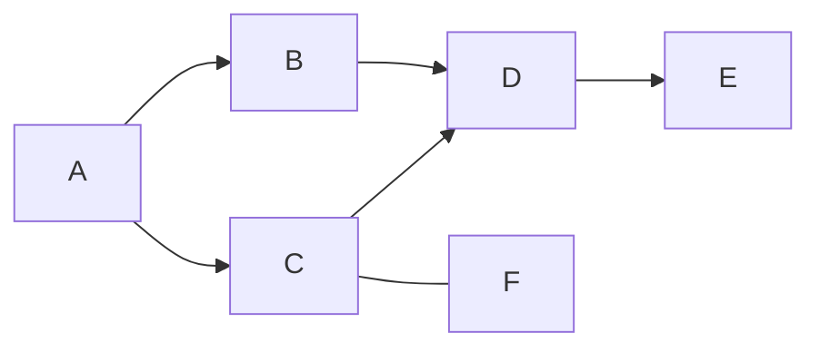

<div style="text-align: center;">

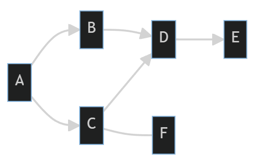

</div>

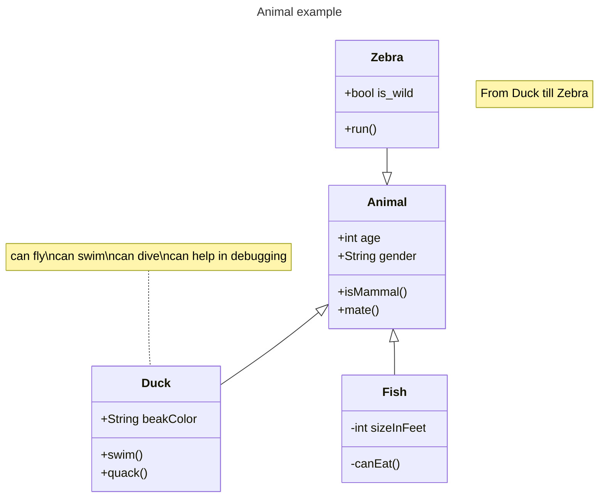

<div style="text-align: center;">

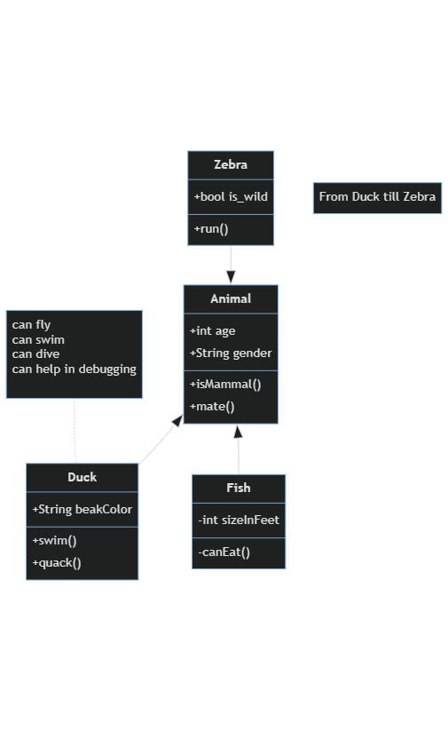

</div>

# 5. 系统模块设计

> 描述系统的各个模块的设计，包括各个模块的功能、模块之间的关系和通信方式、模块的实现方法等等。使用图表、图示等方式展示各个模块之间的关系和通信方式。

# **Assignment 2, Re-design of assignment1 with REST API and More**

# 运行截图

<div style="text-align: center;">


</div>
<div style="text-align: center;">


</div>

# 1. 系统概述

> 简要介绍你要设计的系统，包括系统的目的、目标用户、使用场景、系统需求等等。

+ 用户账户管理系统：用户注册、登录、密码重置、个人信息维护等功能。
+ 运输服务管理系统：包括运输方式、物流方案、配送区域等信息的管理。

# 2. 系统架构

> 描述系统的整体架构，包括系统的分层、组成部分、组件之间的关系、系统流程等等。使用图表、图示等方式展示系统的架构，方便读者理解。


<div style="text-align: center;">


</div>


<div style="text-align: center;">


</div>

# 3. 技术选型

> 列出你在系统设计中使用的技术和工具，包括数据库、编程语言、框架等等。解释你选择这些技术的原因和优势。

编程语言Java

数据库 部署在Linux Ubuntu 22系统的云服务器上的MySQL数据库

框架
Spring Boot

| Aspect      | Frame           | 
|-------------|-----------------|
| DAO         | Spring Data JPA |     
| Web Service | Spring Web      |
| Front       | Thymeleaf       |
| Authority   | Interceptor     |

# 4. 数据库设计

> 详细描述系统的数据结构和数据流，包括数据库的设计和组成，数据表的设计和关系，数据流和数据处理等等。使用图表、图示等方式展示数据库的结构和关系。

```mysql
create table shipment
(
    id                int          not null
        primary key,
    from_address      varchar(255) null,
    to_address        varchar(255) null,
    from_user_user_id int          null,
    to_user_user_id   int          null,
    constraint FK7wxa6jis6bu0rc5hh4h7dd2rr
        foreign key (from_user_user_id) references ship.t_user (user_id),
    constraint FKnfl7w3h9dcsknsk0l4s518amo
        foreign key (to_user_user_id) references ship.t_user (user_id)
);
```

```mysql
create table user
(
    user_id  int          not null
        primary key,
    gender   smallint     null,
    name     varchar(255) null,
    password varchar(255) null
);
```


<div style="text-align: center;">


</div>


<div style="text-align: center;">


</div>

# 5. 系统模块设计

> 描述系统的各个模块的设计，包括各个模块的功能、模块之间的关系和通信方式、模块的实现方法等等。使用图表、图示等方式展示各个模块之间的关系和通信方式。

# **Assignment 3, A shipping and transportation services development with Micro-services Architecture and Spring-Cloud**

# 运行截图

## Eureka

### 控制界面

<div style="text-align: center;">


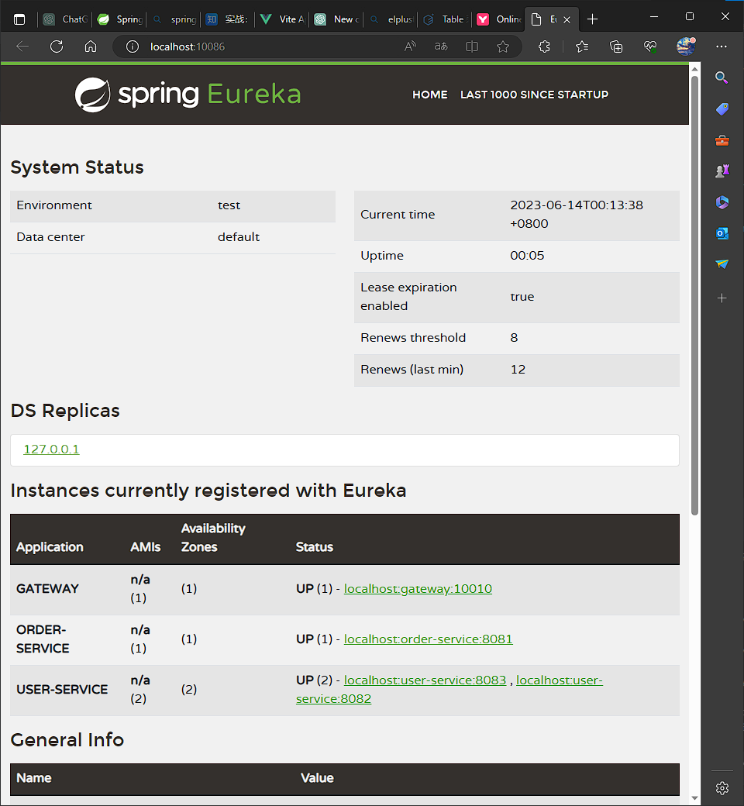

</div>

### Idea运行

<div style="text-align: center;">


</div>

### 负载均衡

```java

@RestController
public class TestRestController {

    KafkaTemplate<Object, Object> kafkaTemplate;

    @Autowired
    public void setKafkaTemplate(KafkaTemplate<Object, Object> kafkaTemplate) {
        this.kafkaTemplate = kafkaTemplate;
    }

    @GetMapping("/send/{input}")
    public void sendFoo(@PathVariable String input) {
        kafkaTemplate.send("test_topic", input);
    }

    @KafkaListener(id = "webGroup", topics = "test_topic")
    public void listen(String input) {
        System.err.println(input);
    }
}
```

#### 第一次访问

<div style="text-align: center;">


</div>

#### 第二次访问

<div style="text-align: center;">


</div>

## 前端

<div style="text-align: center;">


</div>

<div style="text-align: center;">


</div>

# 1. 系统概述

> 简要介绍你要设计的系统，包括系统的目的、目标用户、使用场景、系统需求等等。

+ 用户账户管理系统：用户注册、登录、密码重置、个人信息维护等功能。
+ 运输服务管理系统：包括运输方式、物流方案、配送区域等信息的管理。

# 2. 系统架构

           ┌───────────────────┐        ┌───────────────────┐
           │                   │        │                   │
           │    Eureka Server  │        │                   │
           │   (Port: 10086)   │        │                   │
           │                   │        │                   │
           └───────────────────┘        └───────────────────┘
                       │                            ▲
                       │                            │
            Service Discovery (Eureka)              │
                       │                            │
                       ▼                            │
           ┌───────────────────┐        ┌───────────────────┐
           │                   │        │                   │
           │   Gateway Service │◄──────►│                   │
           │  (Port: 10010)    │        │                   │
           │                   │        │                   │
           └───────────────────┘        └───────────────────┘
                       │                            │
                       ▼                            │
           ┌───────────────────┐        ┌───────────────────┐
           │                   │        │                   │
           │   Order Service   │◄──────►│                   │
           │  (Port: 8081)     │        │                   │
           │                   │        │                   │
           └───────────────────┘        └───────────────────┘
                       │                            │
                       ▼                            │
           ┌───────────────────┐        ┌───────────────────┐
           │                   │        │                   │
           │   User Service    │◄──────►│                   │
           │  (Port: 8082)     │        │                   │
           │                   │        │                   │
           └───────────────────┘        └───────────────────┘
                       │                            │
                       ▼                            ▼
           ┌───────────────────┐        ┌───────────────────┐
           │                   │        │                   │
           │   User Service    │◄──────►│                   │
           │  (Port: 8083)     │        │                   │
           │                   │        │                   │
           └───────────────────┘        └───────────────────┘

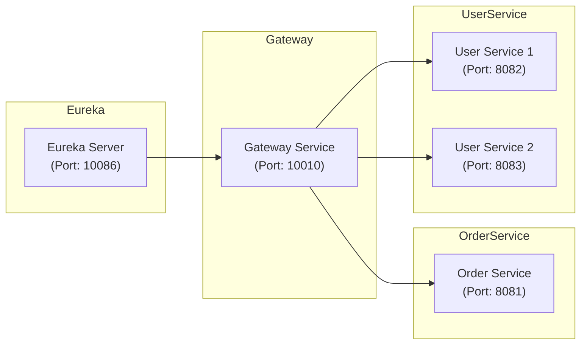

<div style="text-align: center;">

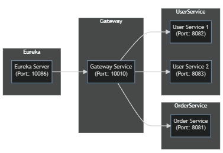

</div>

-

包含了Eureka服务器、Gateway服务、Order服务和两个User服务。Eureka服务器用于服务发现和注册，Gateway服务作为系统的入口点处理所有的外部请求，Order服务负责订单相关的功能，User服务处理用户相关的功能。

-

每个服务都运行在不同的端口上，例如Gateway服务运行在10010端口，Order服务运行在8081端口，User服务分别运行在8082和8083端口。通过Eureka服务器进行服务注册和发现，Gateway服务作为路由器将请求转发到相应的微服务。这种架构可以提供灵活性和可扩展性，每个微服务可以独立开发、部署和扩展。

- 微服务架构在物流网站的系统中可以提供灵活性、可扩展性和可维护性。下面是一个基于微服务的物流网站的系统架构示例：

## 用户界面层（User Interface Layer）：

- 提供用户界面，允许用户注册、登录、浏览货物、下单等操作。
  可以是一个单页应用（SPA），使用现代的前端框架如Vue.js或React构建。
  API网关（API Gateway）：

- 作为整个系统的入口点，接收用户的请求并路由到相应的微服务。
  处理身份验证、授权、请求限流、日志记录等共享功能。
  用户服务（User Service）：

- 负责处理用户相关的功能，如用户注册、登录、个人信息管理等。
  管理用户数据并与身份验证服务进行交互。

## 货物服务（Cargo Service）：

- 处理货物相关的功能，如货物查询、货物状态更新、货物跟踪等。
  管理货物数据并与物流服务进行交互。
  订单服务（Order Service）：

- 处理订单相关的功能，如下单、订单查询、订单状态更新等。
  管理订单数据并与库存服务、支付服务进行交互。
  物流服务（Logistics Service）：

- 负责处理物流相关的功能，如仓库管理、货物配送、路由规划等。
  跟踪货物的位置和状态，并与货物服务进行交互。
  库存服务（Inventory Service）：

- 管理库存数据，包括货物库存、仓库位置、货物入库和出库等操作。
  与订单服务进行交互，更新库存信息。
  支付服务（Payment Service）：

- 处理订单支付功能，与第三方支付网关集成，支持各种支付方式。
  处理支付请求、支付确认和支付状态更新。

> 描述系统的整体架构，包括系统的分层、组成部分、组件之间的关系、系统流程等等。使用图表、图示等方式展示系统的架构，方便读者理解。


<div style="text-align: center;">


</div>


<div style="text-align: center;">


</div>

# 3. 技术选型

> 列出你在系统设计中使用的技术和工具，包括数据库、编程语言、框架等等。解释你选择这些技术的原因和优势。

编程语言Java

数据库 部署在Linux Ubuntu 22系统的云服务器上的MySQL数据库

框架
Spring Boot

| Aspect      | Frame           | 
|-------------|-----------------|
| DAO         | Spring Data JPA |     
| Web Service | Spring Web      |
| Front       | Thymeleaf       |
| Authority   | Interceptor     |

# 4. 数据库设计

对于微服务物流系统，根据提供的服务和端口信息，以下是一个简单的数据库表设计示例：

1. User Service 1（端口：8082）的数据库表设计：
    - 用户表（user）：
        - 用户ID（id）
        - 用户名（username）
        - 密码（password）
        - 邮箱（email）
        - 手机号（phone）

2. User Service 2（端口：8083）的数据库表设计：
    - 用户详细信息表（user_detail）：
        - 用户ID（user_id）
        - 姓名（name）
        - 地址（address）
        - 性别（gender）
        - 生日（birthday）

3. Order Service（端口：8081）的数据库表设计：
    - 订单表（order）：
        - 订单ID（id）
        - 用户ID（user_id）
        - 订单号（order_number）
        - 订单状态（status）
        - 订单金额（amount）
        - 下单时间（created_at）

4. Gateway Service（端口：10010）不涉及数据库表设计，它主要负责路由和请求转发。

5. Eureka Server（端口：10086）作为服务注册中心，不涉及数据库表设计。

关于分库分表，具体的分库分表策略需要根据系统的负载情况、数据量和性能需求来确定。以下是一种可能的分库分表策略的示例：

1. User Service的两个实例（8082和8083）可以使用分库策略，将用户数据根据用户ID的哈希值进行分片，分别存储在不同的数据库中。例如，偶数哈希值的用户存储在一个数据库中，奇数哈希值的用户存储在另一个数据库中。

2. Order Service可以根据订单ID进行分表，将订单数据按照一定的规则分散到不同的表中。例如，可以按照订单创建时间的年份或月份来分表。

请注意，具体的分库分表策略需要根据实际的业务需求和系统性能进行评估和设计。这里只提供了一个简化的示例，你可以根据实际情况进行调整和优化。

> 详细描述系统的数据结构和数据流，包括数据库的设计和组成，数据表的设计和关系，数据流和数据处理等等。使用图表、图示等方式展示数据库的结构和关系。

```mysql
create table shipment
(
    id                int          not null
        primary key,
    from_address      varchar(255) null,
    to_address        varchar(255) null,
    from_user_user_id int          null,
    to_user_user_id   int          null,
    constraint FK7wxa6jis6bu0rc5hh4h7dd2rr
        foreign key (from_user_user_id) references ship.t_user (user_id),
    constraint FKnfl7w3h9dcsknsk0l4s518amo
        foreign key (to_user_user_id) references ship.t_user (user_id)
);
```

```mysql
create table user
(
    user_id  int          not null
        primary key,
    gender   smallint     null,
    name     varchar(255) null,
    password varchar(255) null
);
```


<div style="text-align: center;">


</div>


<div style="text-align: center;">


</div>

# 5. 系统模块设计

> 描述系统的各个模块的设计，包括各个模块的功能、模块之间的关系和通信方式、模块的实现方法等等。使用图表、图示等方式展示各个模块之间的关系和通信方式。
> 基于提供的微服务架构和数据库表设计，下面是一个简单的系统模块设计示例：

1. 用户模块：
    - 注册模块：用户可以通过用户服务（UserService）的接口进行注册，提供用户名、密码、邮箱和手机号等信息。
    - 登录模块：用户可以通过用户服务的接口进行登录，验证用户名和密码，并获取访问令牌（Access Token）用于后续身份验证。
    - 个人信息模块：用户可以通过用户服务的接口管理和更新个人信息，包括姓名、地址、性别和生日等。

2. 货物模块：
    - 货物查询模块：用户可以通过货物服务（Cargo Service）的接口查询货物信息，例如根据货物ID、名称、类型等进行搜索。
    - 货物跟踪模块：用户可以通过货物服务的接口跟踪货物的位置和状态，获取货物的当前位置、配送进度等信息。

3. 订单模块：
    - 下单模块：用户可以通过订单服务（Order Service）的接口创建新订单，提供用户ID、货物ID、数量和金额等信息。
    - 订单查询模块：用户可以通过订单服务的接口查询订单信息，例如根据订单ID、订单状态等进行搜索。
    - 订单状态更新模块：订单服务会根据物流服务（Logistics Service）提供的货物状态更新订单的状态，例如货物已发货、已送达等。

4. 物流模块：
    - 仓库管理模块：物流服务负责管理仓库信息，包括仓库位置、库存情况和货物入库出库记录等。
    - 路由规划模块：物流服务根据货物的起始地和目的地，进行路由规划，确定最佳配送路径。
    - 货物配送模块：物流服务根据路由规划，负责货物的配送过程，包括货物装车、运输、卸货等操作。

5. 支付模块：
    - 支付请求模块：订单服务在创建订单后，将支付请求发送给支付服务（Payment Service），由支付服务处理支付过程。
    - 支付确认模块：支付服务接收到支付请求后，与第三方支付网关进行交互，确认支付状态，并将支付结果返回给订单服务。

以上是一个简化的系统模块设计示例，具体的模块设计和接口定义需要根据业务需求和系统功能来确定。每个模块可以有不同的接口和服务，通过微服务架构实现解耦和独立部署，提高系统的灵活性和可扩展性。

# **Assignment 4, Event-notification for microservices**

# 运行截图

## kafka

### 控制界面

<div style="text-align: center;">

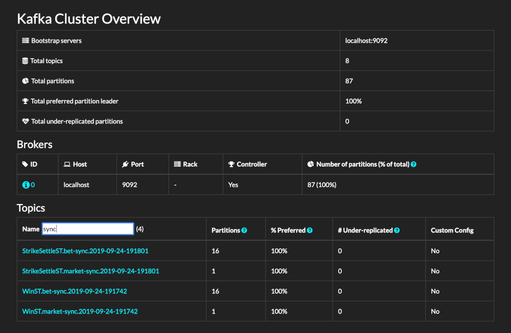

</div>

### Idea运行

<div style="text-align: center;">

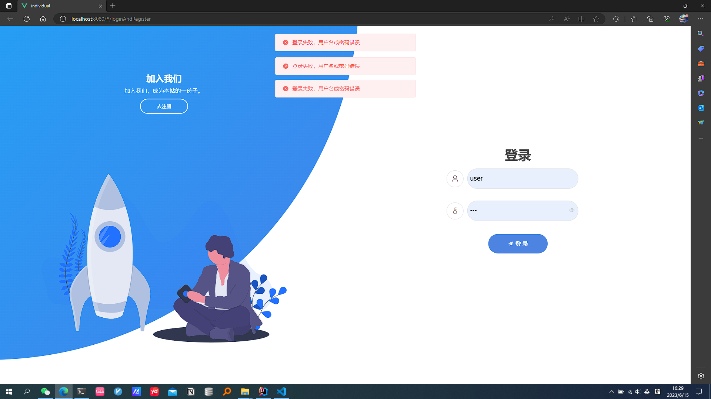

</div>

## 前端

<div style="text-align: center;">


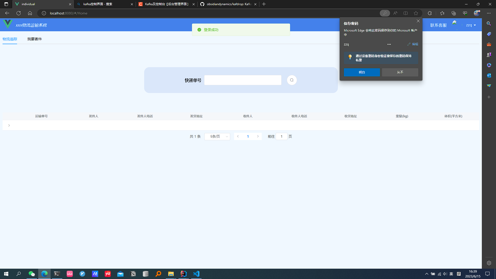

</div>

<div style="text-align: center;">


</div>

# 1. 系统概述

> 简要介绍你要设计的系统，包括系统的目的、目标用户、使用场景、系统需求等等。

+ 用户账户管理系统：用户注册、登录、密码重置、个人信息维护等功能。
+ 运输服务管理系统：包括运输方式、物流方案、配送区域等信息的管理。

# 2. 系统架构

           ┌───────────────────┐        ┌───────────────────┐
           │                   │        │                   │
           │    Eureka Server  │        │                   │
           │   (Port: 10086)   │        │                   │
           │                   │        │                   │
           └───────────────────┘        └───────────────────┘
                       │                            ▲
                       │                            │
            Service Discovery (Eureka)              │
                       │                            │
                       ▼                            │
           ┌───────────────────┐        ┌───────────────────┐
           │                   │        │                   │
           │   Gateway Service │◄──────►│                   │
           │  (Port: 10010)    │        │                   │
           │                   │        │                   │
           └───────────────────┘        └───────────────────┘
                       │                            │
                       ▼                            │
           ┌───────────────────┐        ┌───────────────────┐
           │                   │        │                   │
           │   Order Service   │◄──────►│                   │
           │  (Port: 8081)     │        │                   │
           │                   │        │                   │
           └───────────────────┘        └───────────────────┘
                       │                            │
                       ▼                            │
           ┌───────────────────┐        ┌───────────────────┐
           │                   │        │                   │
           │   User Service    │◄──────►│                   │
           │  (Port: 8082)     │        │                   │
           │                   │        │                   │
           └───────────────────┘        └───────────────────┘
                       │                            │
                       ▼                            ▼
           ┌───────────────────┐        ┌───────────────────┐
           │                   │        │                   │
           │   User Service    │◄──────►│                   │
           │  (Port: 8083)     │        │                   │
           │                   │        │                   │
           └───────────────────┘        └───────────────────┘


<div style="text-align: center;">


</div>

-

包含了Eureka服务器、Gateway服务、Order服务和两个User服务。Eureka服务器用于服务发现和注册，Gateway服务作为系统的入口点处理所有的外部请求，Order服务负责订单相关的功能，User服务处理用户相关的功能。

-

每个服务都运行在不同的端口上，例如Gateway服务运行在10010端口，Order服务运行在8081端口，User服务分别运行在8082和8083端口。通过Eureka服务器进行服务注册和发现，Gateway服务作为路由器将请求转发到相应的微服务。这种架构可以提供灵活性和可扩展性，每个微服务可以独立开发、部署和扩展。

- 微服务架构在物流网站的系统中可以提供灵活性、可扩展性和可维护性。下面是一个基于微服务的物流网站的系统架构示例：

## 用户界面层（User Interface Layer）：

- 提供用户界面，允许用户注册、登录、浏览货物、下单等操作。
  可以是一个单页应用（SPA），使用现代的前端框架如Vue.js或React构建。
  API网关（API Gateway）：

- 作为整个系统的入口点，接收用户的请求并路由到相应的微服务。
  处理身份验证、授权、请求限流、日志记录等共享功能。
  用户服务（User Service）：

- 负责处理用户相关的功能，如用户注册、登录、个人信息管理等。
  管理用户数据并与身份验证服务进行交互。

## 货物服务（Cargo Service）：

- 处理货物相关的功能，如货物查询、货物状态更新、货物跟踪等。
  管理货物数据并与物流服务进行交互。
  订单服务（Order Service）：

- 处理订单相关的功能，如下单、订单查询、订单状态更新等。
  管理订单数据并与库存服务、支付服务进行交互。
  物流服务（Logistics Service）：

- 负责处理物流相关的功能，如仓库管理、货物配送、路由规划等。
  跟踪货物的位置和状态，并与货物服务进行交互。
  库存服务（Inventory Service）：

- 管理库存数据，包括货物库存、仓库位置、货物入库和出库等操作。
  与订单服务进行交互，更新库存信息。
  支付服务（Payment Service）：

- 处理订单支付功能，与第三方支付网关集成，支持各种支付方式。
  处理支付请求、支付确认和支付状态更新。

> 描述系统的整体架构，包括系统的分层、组成部分、组件之间的关系、系统流程等等。使用图表、图示等方式展示系统的架构，方便读者理解。


<div style="text-align: center;">


</div>


<div style="text-align: center;">


</div>

# 3. 技术选型

> 列出你在系统设计中使用的技术和工具，包括数据库、编程语言、框架等等。解释你选择这些技术的原因和优势。

编程语言Java

数据库 部署在Linux Ubuntu 22系统的云服务器上的MySQL数据库

框架
Spring Boot

| Aspect      | Frame           | 
|-------------|-----------------|
| DAO         | Spring Data JPA |     
| Web Service | Spring Web      |
| Front       | Thymeleaf       |
| Authority   | Interceptor     |

# 4. 数据库设计

对于微服务物流系统，根据提供的服务和端口信息，以下是一个简单的数据库表设计示例：

1. User Service 1（端口：8082）的数据库表设计：
    - 用户表（user）：
        - 用户ID（id）
        - 用户名（username）
        - 密码（password）
        - 邮箱（email）
        - 手机号（phone）

2. User Service 2（端口：8083）的数据库表设计：
    - 用户详细信息表（user_detail）：
        - 用户ID（user_id）
        - 姓名（name）
        - 地址（address）
        - 性别（gender）
        - 生日（birthday）

3. Order Service（端口：8081）的数据库表设计：
    - 订单表（order）：
        - 订单ID（id）
        - 用户ID（user_id）
        - 订单号（order_number）
        - 订单状态（status）
        - 订单金额（amount）
        - 下单时间（created_at）

4. Gateway Service（端口：10010）不涉及数据库表设计，它主要负责路由和请求转发。

5. Eureka Server（端口：10086）作为服务注册中心，不涉及数据库表设计。

关于分库分表，具体的分库分表策略需要根据系统的负载情况、数据量和性能需求来确定。以下是一种可能的分库分表策略的示例：

1. User Service的两个实例（8082和8083）可以使用分库策略，将用户数据根据用户ID的哈希值进行分片，分别存储在不同的数据库中。例如，偶数哈希值的用户存储在一个数据库中，奇数哈希值的用户存储在另一个数据库中。

2. Order Service可以根据订单ID进行分表，将订单数据按照一定的规则分散到不同的表中。例如，可以按照订单创建时间的年份或月份来分表。

请注意，具体的分库分表策略需要根据实际的业务需求和系统性能进行评估和设计。这里只提供了一个简化的示例，你可以根据实际情况进行调整和优化。

> 详细描述系统的数据结构和数据流，包括数据库的设计和组成，数据表的设计和关系，数据流和数据处理等等。使用图表、图示等方式展示数据库的结构和关系。

```mysql
create table shipment
(
    id                int          not null
        primary key,
    from_address      varchar(255) null,
    to_address        varchar(255) null,
    from_user_user_id int          null,
    to_user_user_id   int          null,
    constraint FK7wxa6jis6bu0rc5hh4h7dd2rr
        foreign key (from_user_user_id) references ship.t_user (user_id),
    constraint FKnfl7w3h9dcsknsk0l4s518amo
        foreign key (to_user_user_id) references ship.t_user (user_id)
);
```

```mysql
create table user
(
    user_id  int          not null
        primary key,
    gender   smallint     null,
    name     varchar(255) null,
    password varchar(255) null
);
```


<div style="text-align: center;">


</div>


<div style="text-align: center;">


</div>

# 5. 系统模块设计

> 描述系统的各个模块的设计，包括各个模块的功能、模块之间的关系和通信方式、模块的实现方法等等。使用图表、图示等方式展示各个模块之间的关系和通信方式。
> 基于提供的微服务架构和数据库表设计，下面是一个简单的系统模块设计示例：

1. 用户模块：
    - 注册模块：用户可以通过用户服务（UserService）的接口进行注册，提供用户名、密码、邮箱和手机号等信息。
    - 登录模块：用户可以通过用户服务的接口进行登录，验证用户名和密码，并获取访问令牌（Access Token）用于后续身份验证。
    - 个人信息模块：用户可以通过用户服务的接口管理和更新个人信息，包括姓名、地址、性别和生日等。

2. 货物模块：
    - 货物查询模块：用户可以通过货物服务（Cargo Service）的接口查询货物信息，例如根据货物ID、名称、类型等进行搜索。
    - 货物跟踪模块：用户可以通过货物服务的接口跟踪货物的位置和状态，获取货物的当前位置、配送进度等信息。

3. 订单模块：
    - 下单模块：用户可以通过订单服务（Order Service）的接口创建新订单，提供用户ID、货物ID、数量和金额等信息。
    - 订单查询模块：用户可以通过订单服务的接口查询订单信息，例如根据订单ID、订单状态等进行搜索。
    - 订单状态更新模块：订单服务会根据物流服务（Logistics Service）提供的货物状态更新订单的状态，例如货物已发货、已送达等。

4. 物流模块：
    - 仓库管理模块：物流服务负责管理仓库信息，包括仓库位置、库存情况和货物入库出库记录等。
    - 路由规划模块：物流服务根据货物的起始地和目的地，进行路由规划，确定最佳配送路径。
    - 货物配送模块：物流服务根据路由规划，负责货物的配送过程，包括货物装车、运输、卸货等操作。

5. 支付模块：
    - 支付请求模块：订单服务在创建订单后，将支付请求发送给支付服务（Payment Service），由支付服务处理支付过程。
    - 支付确认模块：支付服务接收到支付请求后，与第三方支付网关进行交互，确认支付状态，并将支付结果返回给订单服务。

以上是一个简化的系统模块设计示例，具体的模块设计和接口定义需要根据业务需求和系统功能来确定。每个模块可以有不同的接口和服务，通过微服务架构实现解耦和独立部署，提高系统的灵活性和可扩展性。

