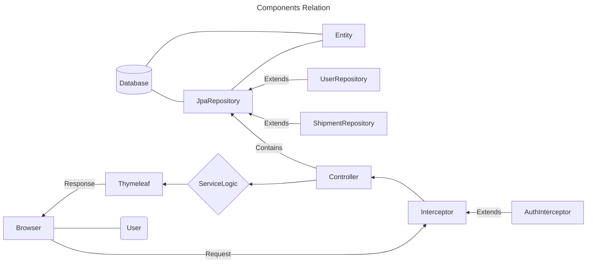
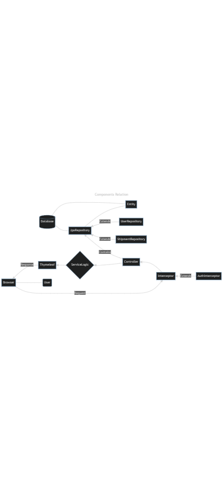
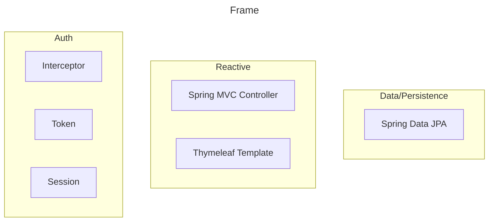
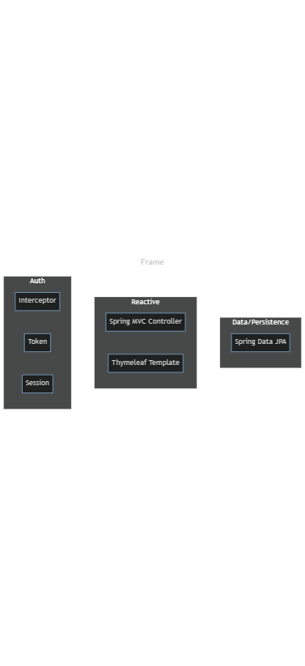
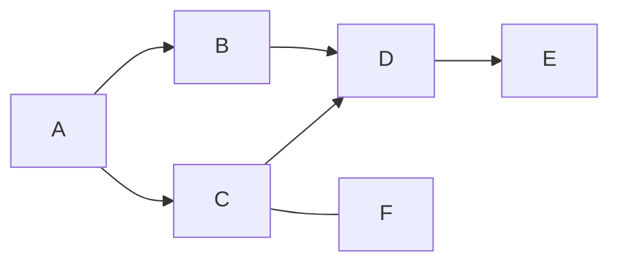
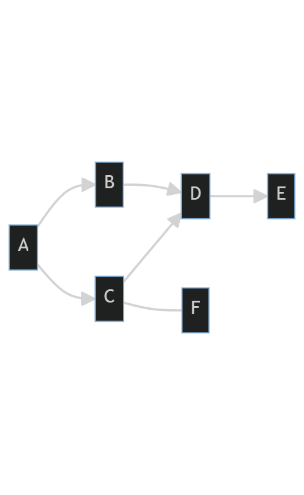
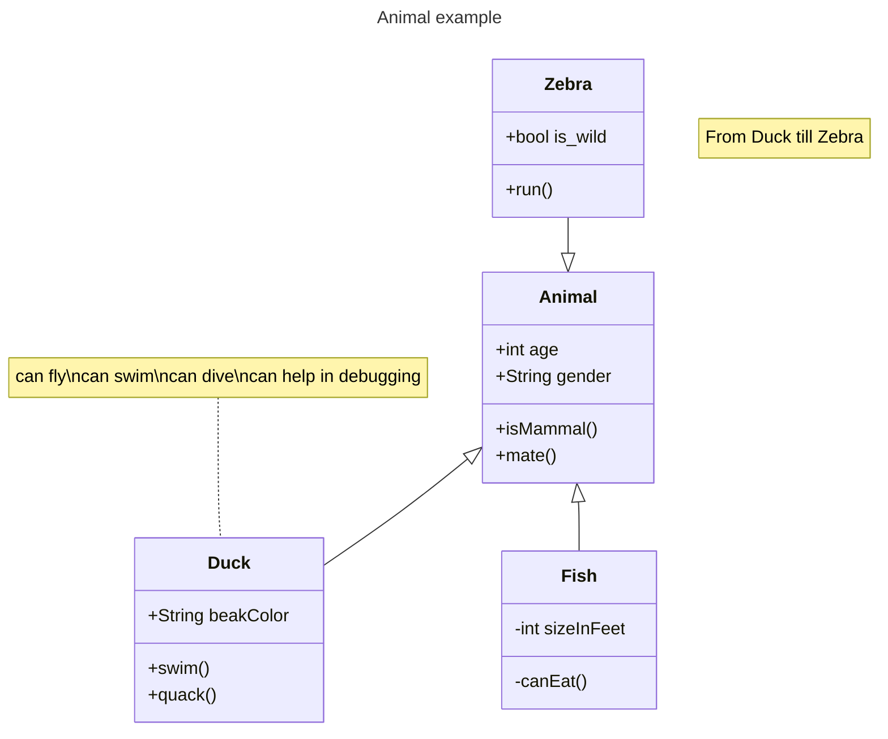

# 运行截图


# 1. 系统概述

> 简要介绍你要设计的系统，包括系统的目的、目标用户、使用场景、系统需求等等。

+ 用户账户管理系统：用户注册、登录、密码重置、个人信息维护等功能。
+ 运输服务管理系统：包括运输方式、物流方案、配送区域等信息的管理。

# 2. 系统架构

> 描述系统的整体架构，包括系统的分层、组成部分、组件之间的关系、系统流程等等。使用图表、图示等方式展示系统的架构，方便读者理解。





# 3. 技术选型

> 列出你在系统设计中使用的技术和工具，包括数据库、编程语言、框架等等。解释你选择这些技术的原因和优势。

编程语言Java

数据库 部署在Linux Ubuntu 22系统的云服务器上的MySQL数据库

框架
Spring Boot

| Aspect      | Frame           | 
|-------------|-----------------|
| DAO         | Spring Data JPA |     
| Web Service | Spring Web      |
| Front       | Thymeleaf       |
| Authority   | Interceptor     |

# 4. 数据库设计

> 详细描述系统的数据结构和数据流，包括数据库的设计和组成，数据表的设计和关系，数据流和数据处理等等。使用图表、图示等方式展示数据库的结构和关系。

```mysql
create table shipment
(
    id                int          not null
        primary key,
    from_address      varchar(255) null,
    to_address        varchar(255) null,
    from_user_user_id int          null,
    to_user_user_id   int          null,
    constraint FK7wxa6jis6bu0rc5hh4h7dd2rr
        foreign key (from_user_user_id) references ship.t_user (user_id),
    constraint FKnfl7w3h9dcsknsk0l4s518amo
        foreign key (to_user_user_id) references ship.t_user (user_id)
);
```

```mysql
create table user
(
    user_id  int          not null
        primary key,
    gender   smallint     null,
    name     varchar(255) null,
    password varchar(255) null
);
```






# 5. 系统模块设计

> 描述系统的各个模块的设计，包括各个模块的功能、模块之间的关系和通信方式、模块的实现方法等等。使用图表、图示等方式展示各个模块之间的关系和通信方式。
